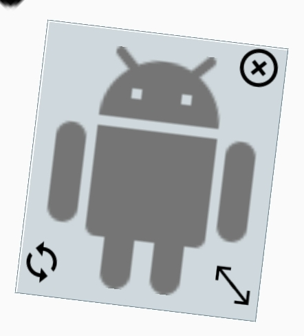

# StickerView
Simple View to help you for scaling, rotating, or moving other views around the screen 


# How to use
- add the view to the framelayout 
```
StickerView st = new StickerView(MainActivity.this);
frame.addView(st);//To add it to framelayout
```
- select the view to edit it using the stickerview 
```
st.select(YourView);//select the view
```
- to unselect 
```
st.unselect();//un selecting

```
- detect rotation and close button click and size changes 
```
st.setOnEvent(new StickerView.onEvent(){
@Override 
public void onSizeChanged(int height,int width){
//height,width
}
@Override 
public void onClose(){
//close clicked
 }
@Override
public void onRotation(float rotation){
//rotation
}
});
```
